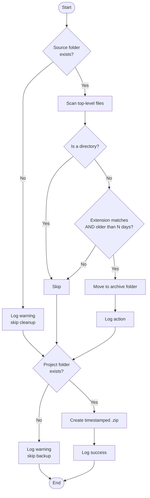

<div align="center">

# 🗂️ cleanup-and-backup

### A lightweight Linux sysadmin utility for automated cleanup & backups


*Scan → Filter by age → Archive → Compress → Backup — fully logged, dry-run safe, cron-ready.*

</div>

---

## 📖 Overview

`cleanup_and_backup.py` is a single-file Python utility that automates two classic system administration tasks:

1. **🧹 Cleanup** — scans a folder (e.g. `~/Downloads`) and moves stale temporary files (older than *N* days) into an archive folder, instead of letting disk space disappear silently.
2. **📦 Backup** — creates a compressed, timestamped `.zip` snapshot of a scripts/projects folder and stores it in a backup destination (local disk, mounted USB drive, or a OneDrive/Dropbox sync folder).

Built as a hands-on exercise in filesystem management, file-age logic, and backup strategy — the everyday fundamentals of help desk and sysadmin work — and hardened through real debugging sessions (see [Troubleshooting](#-troubleshooting)).

---

## ✨ Features

| | |
|---|---|
| 🕒 **Age-based filtering** | Uses file modification time (`mtime`) to find files untouched for N+ days |
| 🗃️ **Safe archiving, not deletion** | Files are *moved*, never deleted — fully reversible |
| 🔐 **Collision-safe** | Auto-renames archived files with a timestamp if a name clash occurs |
| 🗜️ **Real compression** | Uses `ZIP_DEFLATED`, not just file bundling |
| 📝 **Full audit log** | Every action logged to console *and* `~/cleanup_backup.log` |
| 🧪 **Dry-run mode** | Preview every action with zero filesystem changes |
| ⚙️ **Fully configurable** | All paths, thresholds, and extensions set via CLI flags |
| ⏰ **Cron-ready** | Designed to run unattended on a schedule |

---

## 🔧 How It Works



---

## 🚀 Installation

```bash
# Clone or copy the script into your own scripts folder
git clone https://github.com/yourusername/cleanup-and-backup.git
cd cleanup-and-backup

# (Optional) isolate in a virtual environment — only the standard library is used,
# but it's good practice for any Python project
python3 -m venv venv
source venv/bin/activate
```

No external dependencies — pure Python 3 standard library (`pathlib`, `shutil`, `zipfile`, `logging`, `argparse`).

---

## ▶️ Usage

```bash
# Always preview first — no files are touched
python3 cleanup_and_backup.py --dry-run

# Run for real with default settings (~/Downloads, 30 days, ~/projects → ~/Backups)
python3 cleanup_and_backup.py

# Fully customized run
python3 cleanup_and_backup.py \
  --source ~/Desktop \
  --archive ~/Desktop/_archive \
  --days 14 \
  --extensions .tmp .log .crdownload \
  --project-dir ~/dev/my-project \
  --backup-dir /media/usb/Backups
```

### CLI Options

| Flag | Default | Description |
|---|---|---|
| `--source` | `~/Downloads` | Folder to scan for old files |
| `--archive` | `~/Downloads/_old_files_archive` | Destination for archived files |
| `--days` | `30` | Age threshold in days |
| `--extensions` | `.tmp .temp .log .crdownload .part` | "Junk" extensions to target (pass none to match *all* files) |
| `--project-dir` | `~/projects` | Folder to compress and back up |
| `--backup-dir` | `~/Backups` | Destination for the `.zip` (local, USB mount, or cloud-sync folder) |
| `--dry-run` | off | Preview actions, make no changes |

---

## ⏰ Scheduling with Cron

```bash
crontab -e
```

```cron
# Run every Sunday at 3:00 AM — note: absolute paths required, cron has no `~` expansion
0 3 * * 0 /usr/bin/python3 /home/youruser/cleanup-and-backup/cleanup_and_backup.py \
  --source /home/youruser/Desktop \
  --project-dir /home/youruser/dev/my-project \
  --backup-dir /home/youruser/Backups
```

Verify with `crontab -l`.

---

## 🐛 Troubleshooting

Issues actually encountered (and fixed) during development — kept here for anyone hitting the same symptoms.

<details>
<summary><strong>❌ <code>python3: can't open file 'cleanup_and_backup.py': No such file or directory</code> — even though the IDE shows the file in the project root</strong></summary>

<br>

**Diagnosis:**
```bash
pwd
ls -la
find ~ -iname "cleanup_and_backup.py" 2>/dev/null
```

`find` revealed the real location:
```
/home/youruser/python-scripts/venv/cleanup_and_backup.py
```

**Root cause:** The file was created one directory too deep, *inside* `venv/`, not in the project root. In PyCharm, a new file is created as a child of whatever folder is currently selected in the project tree — and `venv/` was selected at creation time. (Telltale sign: in the project tree, the file lined up visually with `pyvenv.cfg`, which `python -m venv` always generates *inside* the venv folder.)

**Fix:**
```bash
mv ~/python-scripts/venv/cleanup_and_backup.py ~/python-scripts/cleanup_and_backup.py
```

**Takeaway:** Select the top-level project folder (or use `File → New → Python File`) before creating new files, so they don't land inside `venv/` by accident.

</details>

<details>
<summary><strong>❌ <code>ls</code> / <code>cat</code> report "No such file or directory" immediately after a successful <code>unzip</code></strong></summary>

<br>

**Diagnosis:** `unzip` printed `inflating: .../projects/test_script.py` with no errors, but the very next commands against the extracted file failed.

**Root cause:** A one-character typo in the extraction destination (`-d /tmp/zip_tes` instead of `/tmp/zip_test`). `unzip` silently created the mistyped folder and extracted there; the follow-up commands pointed at a different (empty) folder that happened to already exist from an earlier `mkdir -p`.

**Fix:** Re-ran the check against the path `unzip` actually printed:
```bash
ls -la /tmp/zip_tes/projects
cat /tmp/zip_tes/projects/test_script.py
```

**Takeaway:** When a command's own output disagrees with your next command's assumption, trust the *first command's printed output* over what you think you typed — diff the strings character by character before assuming the tool is broken.

</details>

---

## 🏗️ Design Notes

- **`mtime` over creation time** — Linux/ext4 doesn't reliably expose file creation dates across filesystems; modification time is the portable standard for file-age checks.
- **Archive folder over OS Trash** — works identically across every Linux desktop environment with zero extra dependencies. For true OS-trash integration, swap in [`send2trash`](https://pypi.org/project/Send2Trash/).
- **Directories are explicitly skipped** during cleanup — verified in testing against a live Thunderbird working directory (`*.tmp` folder) that would otherwise have been mistakenly archived.
- **Timestamped backups** rather than overwrite-in-place — each run preserves history instead of destroying the previous backup.

---

## 📁 Project Structure

```
cleanup-and-backup/
├── cleanup_and_backup.py   # main script
├── README.md
└── venv/                   # local virtual environment (gitignored)
```

---

## 📜 License

Distributed under the MIT License. Free to use, modify, and adapt.

---

<div align="center">

*Built as a hands-on systems administration exercise — filesystem management, file-age logic, and backup automation.*

</div>